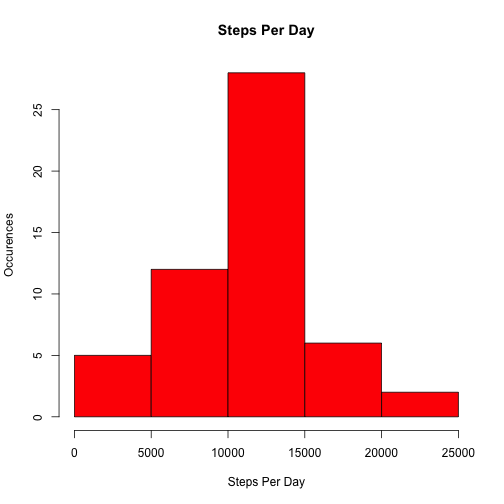
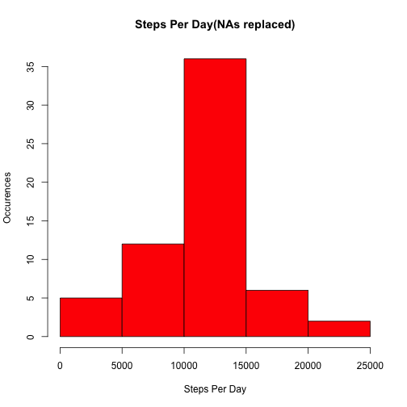

## Loading and preprocessing the data

Read the csv file (I assume that it is in the current working directory) and convert the date column to date type

```r
library(plyr)
data = read.csv("activity.csv", header=TRUE)
data$date = as.Date(data$date)
```
## What is mean total number of steps taken per day?

summary is steps per day. Create a histogram, calculate the mean and median

```r
summary = ddply(data, "date", summarize, steps = sum(steps))
hist(summary$steps, main="Steps Per Day",  xlab="Steps Per Day", ylab="Occurences", col="Red")
```

 

```r
mean(summary$steps, na.rm=TRUE)
```

```
## [1] 10766
```

```r
median(summary$steps, na.rm=TRUE)
```

```
## [1] 10765
```
## What is the average daily activity pattern?

interval_summary is steps per 5 minute interval. Create a time-series plot and find the interval with the most steps.

```r
interval_summary = ddply(data, "interval", summarize, steps=mean(steps, na.rm=TRUE))
plot(interval_summary, type="l")
```

 

```r
max_interval = interval_summary[order(-interval_summary$steps),][1,]$interval
```

## Imputing missing values

count NAs, then replace them with the mean for the 5 minute interval they are in. Create a histogram, calculate the mean and median


```r
number_NAs = summary(data$steps)[7]
data_imputed$steps <- with(data,ifelse(
  is.na(steps),
  ave(steps,interval,FUN=function(x) mean(x,na.rm=TRUE)),
  steps
))
summary_imputed = ddply(data_imputed, "date", summarize, steps = sum(steps))
hist(summary_imputed$steps, main="Steps Per Day(NAs replaced)",  xlab="Steps Per Day", ylab="Occurences", col="Red")
```

 

```r
mean(summary_imputed$steps)
```

```
## [1] 10766
```

```r
median(summary_imputed$steps)
```

```
## [1] 10766
```

## Are there differences in activity patterns between weekdays and weekends?

From the data with imputed NAs, label them as weekdays or weekends. Create a time-series plot of steps per 5-minute interval for weekdays and weekends


```r
data_imputed$weekdays = ifelse(weekdays(data_imputed$date)=="Saturday" | weekdays(data_imputed$date) == "Sunday", "weekend", "weekday")
weekday_data_imputed = subset(data_imputed, data_imputed$weekday == "weekday")
weekend_data_imputed = subset(data_imputed, data_imputed$weekday == "weekend")
weekday_interval =  ddply(weekday_data_imputed, "interval", summarize, steps=mean(steps))
weekend_interval =  ddply(weekend_data_imputed, "interval", summarize, steps=mean(steps))
par(mfrow = c(2, 1))
plot(weekday_interval, type="l", main="weekday", xaxt="n", yaxt="n", ylab="", xlab="")
axis(4)
plot(weekend_interval, type="l", main="weekend")
```

 

